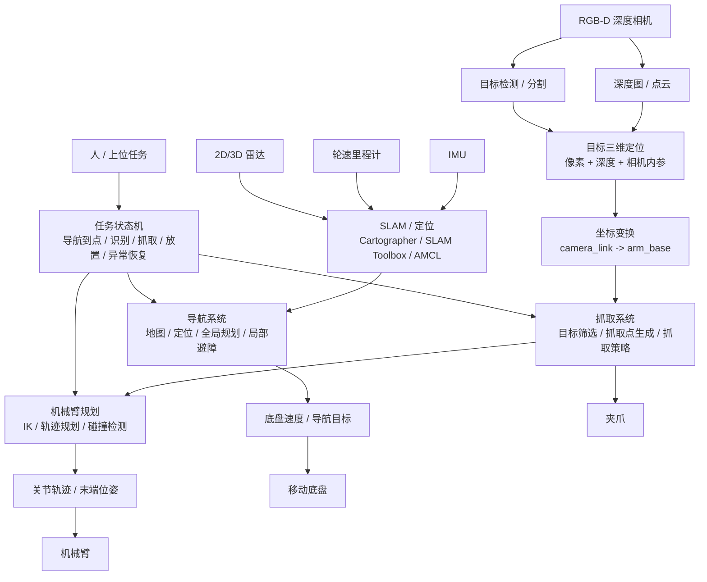
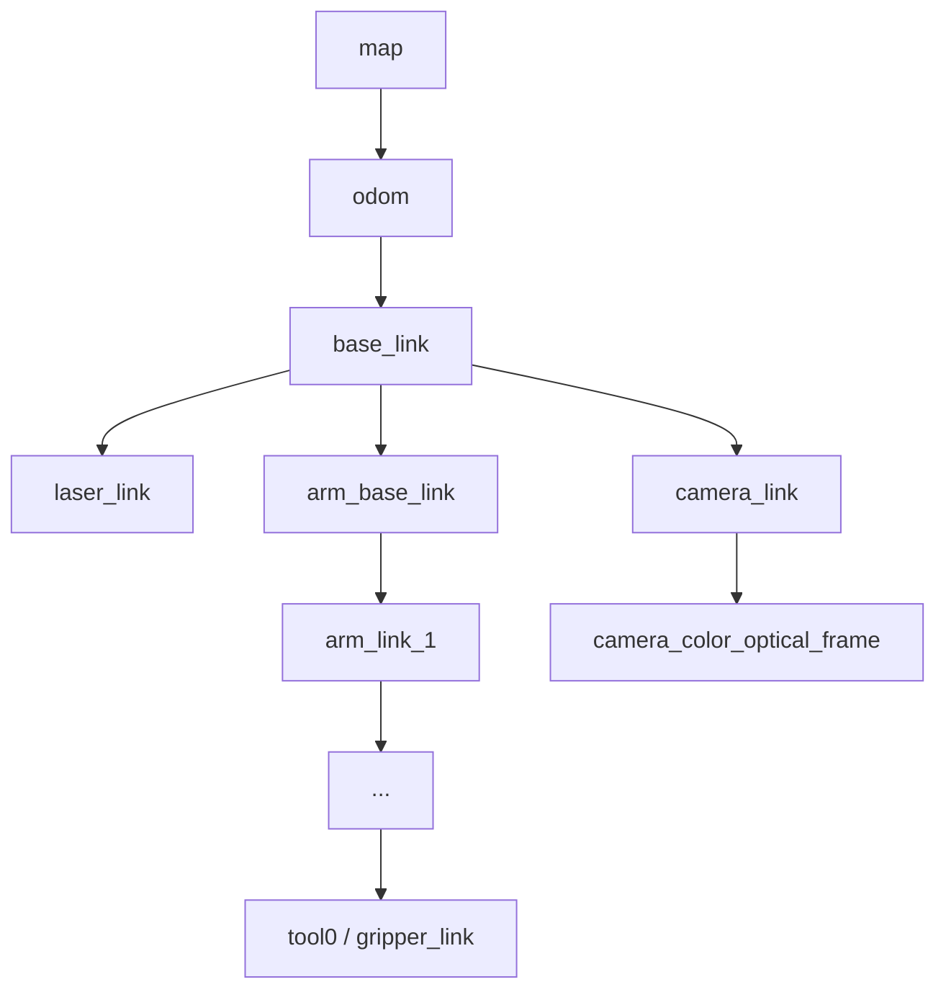
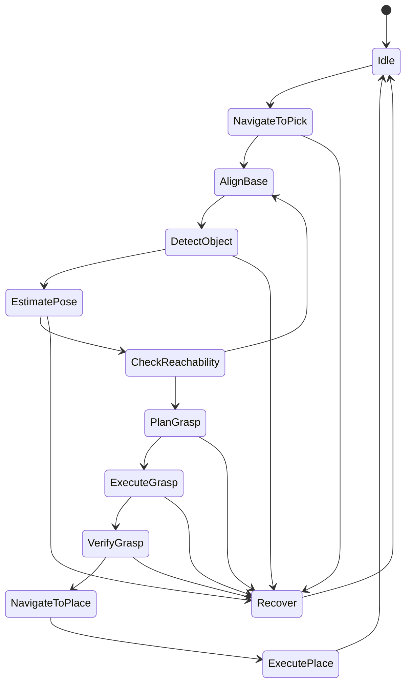

# 移动抓取机器人开发全流程

雷达建图导航、深度相机三维识别、机械臂逆运动学抓取、ROS 2 工程部署一次讲清

更新时间：2026-06-18

## 工程源码入口

这个仓库不是只有文章，已经包含一套可扩展的 ROS 2 移动抓取工程骨架。

| 目录 | 内容 |
| --- | --- |
| `src/perception_3d` | RGB-D 目标检测模拟节点、深度反投影节点 |
| `src/grasp_planner` | 目标三维点到预抓取/抓取位姿的规划节点 |
| `src/task_manager` | 移动抓取任务状态机节点 |
| `src/mobile_manipulation_bringup` | ROS 2 launch 和参数配置包 |
| `config` | 顶层参数模板 |
| `scripts` | 依赖安装、话题检查、发布辅助脚本 |
| `docs` | CSDN 发布稿、架构、部署、排错文档 |

## 快速编译

推荐环境：

```text
Ubuntu 22.04 + ROS 2 Humble
```

把仓库作为 ROS 2 工作空间源码使用：

```bash
mkdir -p ~/mobile_manipulation_ws/src
cd ~/mobile_manipulation_ws/src
git clone https://github.com/lelala271/mobile-manipulation-nav-grasp.git
cd ~/mobile_manipulation_ws
rosdep install --from-paths src --ignore-src -r -y
colcon build --symlink-install
source install/setup.bash
```

启动演示管线：

```bash
ros2 launch mobile_manipulation_bringup demo_pipeline.launch.py
```

当前演示管线包含：

```text
mock_detector
-> depth_projector
-> grasp_pose_planner
-> pick_place_state_machine
```

接真实硬件时，需要把 `mock_detector` 替换成真实目标检测节点，把默认相机内参、深度图、手眼标定和机械臂驱动接入对应话题。

## 0. 这篇文章解决什么问题

移动机器人开发里最容易混乱的地方，是把“导航车”“视觉识别”“机械臂控制”“自主抓取”混成一个词。实际工程里，这四件事属于不同层级：

```text
底盘导航负责把机器人移动到目标区域
雷达负责建图、定位和避障
深度相机负责把目标从二维图像变成三维坐标
机械臂负责把三维目标点变成可执行的关节运动
任务状态机负责把导航、识别、抓取、放置串成闭环
```

如果不先分层，后面会出现典型问题：

```text
地图能建，但机械臂不知道目标在哪里
相机能识别，但输出只是二维框，不能抓
机械臂能动，但没有手眼标定，抓取点坐标不对
导航能到点，但底盘停的位置不在机械臂工作空间内
单个模块都能跑，整体任务却无法自主闭环
```

本文目标是把一套通用的移动抓取机器人系统讲清楚：如何用雷达完成建图、定位、导航和避障；如何用深度相机完成目标识别与三维定位；如何用机械臂逆运动学和轨迹规划完成自主抓取；如何用 ROS 2 把所有模块组织成可部署、可调试、可扩展的工程。

一句话核心结论：

```text
移动抓取不是“导航算法加一个机械臂”，而是“底盘全局移动能力 + RGB-D 三维感知能力 + 机械臂局部操作能力 + 任务状态机”的系统工程。
```

## 1. 先看总图

移动抓取系统可以按“硬件层、驱动层、感知层、规划层、执行层、任务层”理解。



图 1：移动抓取系统不是单算法系统，而是多模块闭环系统。

最小闭环可以写成下面这条链：

```text
雷达建图/定位
-> 底盘导航到抓取区域
-> 深度相机识别目标
-> 像素坐标 + 深度 + 相机内参得到相机坐标
-> 手眼标定转换到机械臂基座坐标
-> 生成抓取位姿
-> 逆运动学求关节角
-> 轨迹规划避碰
-> 夹爪闭合
-> 抬升和撤离
```

这个链条里任何一环缺失，系统都只能算“部分功能可用”，不能叫自主抓取闭环。

## 2. 名词先分类

先把容易混淆的概念放到一张表里。

| 类别 | 代表内容 | 解决的问题 | 不是用来干什么的 |
| --- | --- | --- | --- |
| 操作系统 | Ubuntu 20.04、Ubuntu 22.04 | 提供运行环境、驱动、依赖管理 | 不直接决定机器人算法能力 |
| 中间件 | ROS 1、ROS 2 | 节点通信、话题、服务、动作、TF、参数 | 不是具体导航或抓取算法 |
| 建图算法 | Cartographer、SLAM Toolbox、RTAB-Map | 建立环境地图并估计位姿 | 不直接控制底盘电机 |
| 定位算法 | AMCL、Cartographer localization | 在已有地图中估计机器人位姿 | 不负责机械臂抓取 |
| 导航框架 | Nav2 | 全局规划、局部避障、行为树导航 | 不负责目标视觉识别 |
| 视觉算法 | YOLO、传统颜色分割、实例分割 | 找到目标类别和图像区域 | 只输出二维框时不能直接抓取 |
| 深度处理 | 深度图、点云、相机内参 | 把二维目标变成三维坐标 | 不替代机械臂逆运动学 |
| 手眼标定 | eye-to-hand、eye-in-hand | 建立相机坐标系与机械臂坐标系关系 | 不解决目标检测准确率 |
| 运动学 | FK、IK、Jacobian | 位姿和关节角之间转换 | 不负责地图导航 |
| 轨迹规划 | MoveIt、OMPL、Pilz | 生成安全可执行的机械臂轨迹 | 不保证目标识别正确 |
| 任务状态机 | Behavior Tree、SMACH、ROS 2 Lifecycle、自定义状态机 | 编排导航、识别、抓取、失败恢复 | 不是单个算法模型 |

如果只能记一条：

```text
雷达回答“车在哪里、怎么走”，深度相机回答“目标在三维空间哪里”，机械臂回答“末端怎么过去”，任务状态机回答“什么时候做哪一步”。
```

## 3. 系统硬件层

移动抓取机器人最少由四类硬件组成：

| 硬件 | 常见形式 | 核心指标 | 工程关注点 |
| --- | --- | --- | --- |
| 移动底盘 | 差速、麦克纳姆、阿克曼、履带 | 速度、载重、里程计精度、最小转弯半径 | 是否能稳定到达机械臂可抓区域 |
| 雷达 | 2D 激光雷达、3D 激光雷达 | 角分辨率、频率、量程、抗光干扰 | 建图定位和局部避障质量 |
| 深度相机 | 结构光、双目、ToF、RGB-D | 深度范围、深度噪声、视场角、光照适应性 | 目标三维定位是否稳定 |
| 机械臂 | 串联机械臂、协作臂、小型桌面臂 | 自由度、负载、重复定位精度、工作空间 | 能否覆盖抓取区域 |
| 夹爪 | 二指夹爪、吸盘、柔性夹爪 | 开口、夹持力、控制方式 | 与目标形状是否匹配 |
| 工控机 | x86、ARM、Jetson、NUC | CPU/GPU、USB、网口、串口 | 是否能同时跑感知、导航和规划 |

### 3.1 底盘不是越快越好

很多人做移动抓取时，会先关心底盘最高速度。对自主抓取来说，更关键的是低速稳定性和到点精度。机械臂工作空间是有限的，底盘停偏十几厘米，可能目标就在机械臂够不到的位置。

底盘要重点看：

```text
低速是否爬行稳定
原地旋转是否打滑
里程计是否连续
急停后是否有明显惯性滑移
导航到点后姿态角误差是否可接受
```

如果底盘定位粗糙，抓取系统可以通过视觉二次对准补偿一部分误差，但不能无限补偿。工程上常见做法是：

```text
导航阶段只要求到达抓取区域
视觉阶段判断目标是否在机械臂工作空间内
如果不在，底盘做小范围二次调整
调整后重新识别
再进入机械臂抓取
```

### 3.2 雷达负责“车的空间安全”

雷达在移动抓取里主要负责底盘空间安全：

```text
建图
定位
全局导航
局部避障
判断通行空间
```

它不直接负责识别要抓的物体。雷达能看到障碍物轮廓，但对小物体、透明物体、桌面目标、语义类别并不擅长。用雷达做“导航避障”合理，用雷达做“识别抓取目标”通常不合适。

### 3.3 深度相机负责“目标的三维位置”

普通 RGB 相机只能告诉你目标在图像第几行第几列。机械臂需要的是目标在三维空间中的位置，例如：

```text
x = 0.42 m
y = -0.08 m
z = 0.31 m
坐标系 = arm_base
```

深度相机的作用就是把目标从二维图像变成三维空间点。典型过程是：

```text
检测模型输出目标框
在目标框中选取可信深度像素
用相机内参把像素反投影成三维点
用手眼标定矩阵把相机坐标转换到机械臂基座坐标
```

### 3.4 机械臂负责“局部精细操作”

机械臂不是导航系统的替代品。它只能在自己的工作空间内操作。移动抓取系统里，底盘和机械臂是协作关系：

```text
底盘负责大范围移动
机械臂负责小范围精确抓取
```

如果底盘停得太远，机械臂再强也够不到。如果目标点识别不准，机械臂运动再平滑也抓不到。

## 4. ROS 2 系统层

ROS 2 在这个系统里不是“可有可无的通信工具”，而是工程组织方式。它负责把底盘、雷达、相机、机械臂、夹爪、任务逻辑拆成节点，并通过统一消息接口连接起来。

### 4.1 节点划分

建议节点职责这样拆：

| 节点 | 输入 | 输出 | 职责 |
| --- | --- | --- | --- |
| `base_driver` | 串口/CAN/网络底盘反馈 | `/odom`、`/imu`、`/tf` | 底盘驱动和里程计上报 |
| `lidar_driver` | 雷达数据 | `/scan` 或 `/points` | 雷达驱动 |
| `camera_driver` | RGB-D 相机 | `/color/image_raw`、`/depth/image_raw`、`/camera_info` | 相机数据发布 |
| `slam_node` | `/scan`、`/odom`、`/tf` | `/map`、`map->odom` | 建图或定位 |
| `nav2` | 地图、定位、雷达 | `/cmd_vel` | 导航和避障 |
| `detector` | RGB 图像 | 目标类别、二维框、置信度 | 目标识别 |
| `depth_projector` | 目标框、深度图、相机内参 | 相机坐标系下三维点 | RGB-D 三维定位 |
| `handeye_transformer` | 相机坐标点、TF | 机械臂基座坐标点 | 坐标转换 |
| `grasp_planner` | 目标三维点、目标类型 | 抓取位姿 | 抓取策略 |
| `arm_driver` | 轨迹指令 | 关节状态、执行结果 | 机械臂控制 |
| `gripper_driver` | 开合指令 | 夹爪状态 | 夹爪控制 |
| `task_manager` | 所有模块状态 | 导航目标、抓取命令 | 总任务编排 |

这种拆法的好处是每个模块可以单独验证。不要把视觉识别、深度转换、IK、夹爪控制全部塞进一个脚本里，否则排错会非常痛苦。

### 4.2 话题、服务、动作怎么分

ROS 2 里三类通信不要混用。

| 通信方式 | 适合内容 | 示例 | 不适合内容 |
| --- | --- | --- | --- |
| Topic | 连续数据流 | 图像、雷达、里程计、关节状态 | 需要明确成功/失败的任务 |
| Service | 短请求、短响应 | 保存地图、查询状态、切换模式 | 长时间导航或抓取 |
| Action | 耗时任务、有反馈、可取消 | 导航到点、机械臂执行轨迹、抓取任务 | 高频传感器数据 |

自主抓取最好设计成 Action，因为它不是瞬时动作。抓取过程中可能经历：

```text
等待导航到位
等待视觉识别
等待机械臂规划
等待轨迹执行
等待夹爪闭合
判断抓取结果
失败重试
```

这些都需要反馈和取消机制。

### 4.3 TF 是整套系统的骨架

移动抓取至少需要这些坐标系：

```text
map
odom
base_link
laser_link
camera_link
camera_color_optical_frame
camera_depth_optical_frame
arm_base_link
tool0
gripper_link
object_frame
```

典型 TF 树：



图 2：移动抓取系统的 TF 必须同时覆盖底盘、传感器、机械臂和末端执行器。

这里最容易错的是相机坐标系。ROS 光学坐标系通常是：

```text
x 向右
y 向下
z 向前
```

而机器人本体坐标常见约定是：

```text
x 向前
y 向左
z 向上
```

如果不区分 `camera_link` 和 `camera_optical_frame`，深度点转换出来会方向错，表现为目标点上下颠倒、左右反、距离方向不对。

## 5. 雷达建图与自主导航

移动抓取中的导航目标不是“地图好看”，而是让底盘稳定到达适合抓取的位置。雷达导航链路可以分成：

```text
雷达驱动
-> 里程计/IMU
-> TF
-> SLAM 建图
-> 地图保存
-> 静态地图定位
-> 全局规划
-> 局部避障
-> 底盘速度控制
```

### 5.1 Cartographer 在系统中的位置

Cartographer 是 SLAM 算法，用来建图和估计位姿。它适合讲清 SLAM 的“前端局部匹配 + 后端位姿图优化”思想，但它不是完整导航系统。

| 模块 | 负责什么 | 不负责什么 |
| --- | --- | --- |
| Cartographer | 用雷达、里程计、IMU 建图和估计位姿 | 不负责最终路径规划和底盘控制 |
| Nav2 | 路径规划、局部避障、行为树导航、发布速度命令 | 不负责把未知环境建成地图 |
| AMCL | 在已有地图中定位 | 不负责在线建图 |
| 底盘驱动 | 执行 `/cmd_vel` 并回传里程计 | 不负责规划路线 |

### 5.2 Cartographer 核心原理

Cartographer 的核心可以概括为：

```text
局部 SLAM 负责实时扫描匹配和子图构建
全局 SLAM 负责回环检测和位姿图优化
```

局部 SLAM 处理当前传感器数据。它会根据上一时刻位姿、里程计和 IMU 预测当前大概位置，然后把当前激光和已有局部子图做扫描匹配。匹配成功后，把这帧激光插入子图。

全局 SLAM 处理长期一致性。机器人走久了必然有漂移。当机器人回到走过的位置，算法会尝试发现回环，并把当前轨迹节点和历史子图建立约束。后端优化会重新调整所有节点和子图的位置，让整张地图更一致。

### 5.3 子图为什么重要

Cartographer 不直接维护一张不断膨胀的大地图，而是维护很多局部子图。子图可以理解成机器人在一小段时间内看到的局部环境块。

这样做有三个工程意义：

| 意义 | 解释 |
| --- | --- |
| 实时性 | 局部匹配只需要和当前活动子图对齐，计算量可控 |
| 稳定性 | 局部范围更容易保持几何一致 |
| 可优化性 | 后端可以把子图作为图优化对象进行全局调整 |

如果地图直接全局更新，每次误差都会污染整图；如果使用子图，局部误差可以先限制在局部，再通过后端优化分配到全局。

### 5.4 Nav2 在系统中的位置

Nav2 是 ROS 2 的导航框架。它主要包含：

| 组件 | 作用 |
| --- | --- |
| `map_server` | 加载静态地图并发布 |
| `amcl` | 基于地图和激光进行定位 |
| `planner_server` | 生成全局路径 |
| `controller_server` | 跟踪路径并输出速度 |
| `behavior_server` | 执行恢复行为 |
| `bt_navigator` | 用行为树组织导航流程 |
| `lifecycle_manager` | 管理节点生命周期 |

在移动抓取系统里，Nav2 只负责底盘到位。到位之后，是否开始抓取，要由任务状态机判断。判断条件通常包括：

```text
导航 Action 是否成功
底盘速度是否接近 0
当前位姿是否在抓取区域容差内
目标是否被视觉系统稳定识别
目标是否在机械臂工作空间内
```

## 6. 深度相机识别与三维定位

深度相机在移动抓取里最核心的作用是：把视觉识别结果变成机械臂能用的三维坐标。

### 6.1 RGB 检测只解决“看见”

目标检测模型通常输出：

```text
类别 class
置信度 confidence
二维框 bbox = [u_min, v_min, u_max, v_max]
```

这只能说明目标在图像中的范围。它不能直接告诉机械臂目标离自己多远，也不能告诉目标在机械臂基座坐标系下的位置。

### 6.2 深度图解决“距离”

深度图每个像素存储该点到相机的距离。拿到目标框后，一般不直接取框中心深度，因为框中心可能落在空洞、反光区域或背景上。更稳妥的做法是：

```text
在目标框中选取中心区域
过滤无效深度
过滤过近和过远值
取中位数或截尾均值
得到目标代表深度
```

中位数比均值更抗异常点。比如目标框里混进背景深度，均值会被拉偏，中位数更稳。

### 6.3 像素反投影

相机内参通常包括：

```text
fx, fy: 焦距
cx, cy: 主点
```

像素点 `(u, v)` 和深度 `Z` 可以反投影到相机坐标系：

```text
X = (u - cx) * Z / fx
Y = (v - cy) * Z / fy
Z = depth
```

这一步的意义是把图像坐标变成相机三维坐标。注意这里的坐标仍然在相机坐标系下，机械臂不能直接用。

### 6.4 手眼标定解决“坐标系转换”

机械臂执行抓取需要目标在 `arm_base_link` 下的坐标。相机看到的是 `camera_color_optical_frame` 下的坐标。两者之间必须有变换关系：

```text
T_arm_base_camera
```

转换公式：

```text
P_arm_base = T_arm_base_camera * P_camera
```

如果相机固定在底盘或外部支架上，叫 eye-to-hand。如果相机装在机械臂末端，叫 eye-in-hand。

| 类型 | 相机位置 | 优点 | 难点 |
| --- | --- | --- | --- |
| eye-to-hand | 固定在底盘或环境中 | 视野稳定，适合先识别再抓取 | 机械臂运动时目标可能被遮挡 |
| eye-in-hand | 固定在末端 | 可近距离二次定位 | 标定和运动补偿更复杂 |

### 6.5 目标位姿不等于抓取位姿

识别得到的目标中心点只是目标位置，不一定是夹爪应该到达的位置。抓取位姿还需要：

```text
抓取方向
夹爪开口方向
预抓取偏移
接近距离
抬升方向
避障约束
```

例如一个杯子，中心点在杯身内部，夹爪不能直接去中心点，而应选择杯身两侧的夹持位置。一个盒子可以从上方抓，一个瓶子可能需要从侧面抓。

## 7. 机械臂逆运动学与抓取

机械臂控制要分清三个层级：

```text
运动学：位姿和关节角之间的几何关系
轨迹规划：从当前关节状态到目标关节状态怎么安全移动
执行控制：底层驱动如何让电机跟随轨迹
```

### 7.1 正运动学和逆运动学

正运动学 FK：

```text
输入：关节角 q
输出：末端位姿 T
```

逆运动学 IK：

```text
输入：末端目标位姿 T
输出：关节角 q
```

抓取时我们通常先得到目标末端位姿，所以需要 IK。IK 可能无解，原因包括：

```text
目标超出工作空间
姿态约束太严格
关节限位冲突
碰撞约束不允许
当前机械臂构型接近奇异位形
```

### 7.2 IK 有解不代表能安全执行

IK 只是求一个关节配置。真正执行前还需要轨迹规划：

```text
当前关节状态 -> 预抓取姿态 -> 抓取姿态 -> 闭合夹爪 -> 抬升姿态 -> 回收姿态
```

轨迹规划要检查：

```text
机械臂自身碰撞
机械臂和底盘碰撞
机械臂和环境碰撞
关节速度限制
关节加速度限制
末端路径是否穿过障碍
```

### 7.3 抓取动作应拆成阶段

不要让机械臂直接从当前位置冲到目标点。工程上建议拆成：

| 阶段 | 目标 | 说明 |
| --- | --- | --- |
| Home | 回安全位 | 避免从未知姿态开始抓取 |
| Pre-grasp | 到达预抓取位 | 位于目标前方或上方一定距离 |
| Approach | 接近目标 | 低速直线靠近 |
| Close | 夹爪闭合 | 根据目标宽度或力反馈控制 |
| Lift | 抬升 | 判断是否抓稳 |
| Retreat | 撤离 | 回到安全运输姿态 |
| Place | 放置 | 到放置区打开夹爪 |

这种阶段化设计非常重要，因为失败恢复要依赖阶段边界。比如识别失败和夹爪闭合失败的处理完全不同。

## 8. 任务状态机

移动抓取系统最需要状态机，因为它不是单次函数调用，而是一串带条件判断和失败恢复的动作。

推荐状态如下：



图 3：移动抓取任务状态机必须包含失败恢复，不然现场调试会很难。

每个状态都要有进入条件、退出条件、超时条件和失败条件。

| 状态 | 进入条件 | 成功条件 | 失败条件 |
| --- | --- | --- | --- |
| `NavigateToPick` | 收到任务目标 | 到达抓取区域 | 导航失败或超时 |
| `AlignBase` | 到达区域 | 目标进入工作空间 | 底盘调整失败 |
| `DetectObject` | 相机正常 | 连续多帧识别稳定 | 目标丢失 |
| `EstimatePose` | 有目标框和深度 | 输出稳定三维坐标 | 深度无效或跳变 |
| `CheckReachability` | 有目标位姿 | IK 可解、无碰撞 | 目标不可达 |
| `PlanGrasp` | 抓取策略确定 | 轨迹规划成功 | 规划失败 |
| `ExecuteGrasp` | 轨迹可执行 | 夹爪闭合并抬升 | 执行超时或急停 |
| `VerifyGrasp` | 抓取完成 | 目标仍在夹爪中 | 掉落或未夹住 |

## 9. Linux 与 ROS 2 部署路线

推荐主线：

```text
Ubuntu 22.04 + ROS 2 Humble
```

原因：

```text
ROS 2 Humble 是长期支持版本
Ubuntu 22.04 是 Humble 的标准平台
Nav2、MoveIt 2、主流 ROS 2 包支持更顺
```

Ubuntu 20.04 也能做机器人开发，但更自然对应 ROS 2 Foxy。若要在 Ubuntu 20.04 上跑 Humble 或移植 22.04 编译产物，容易遇到 `glibc`、`libstdc++`、二进制 ABI 和依赖版本问题。工程上更稳的做法是：

```text
能统一到 Ubuntu 22.04 + ROS 2 Humble，就统一
必须使用 Ubuntu 20.04，就从源码重新编译，并逐包验证依赖
不要直接复制 build/install 目录当成部署方案
```

### 9.1 安装 ROS 2 Humble

官方文档：

[ROS 2 Humble Ubuntu Install](https://docs.ros.org/en/humble/Installation/Ubuntu-Install-Debs.html)

常用安装流程：

```bash
sudo apt update
sudo apt install -y software-properties-common curl
sudo add-apt-repository universe -y

sudo curl -sSL https://raw.githubusercontent.com/ros/rosdistro/master/ros.key \
  -o /usr/share/keyrings/ros-archive-keyring.gpg

echo "deb [arch=$(dpkg --print-architecture) signed-by=/usr/share/keyrings/ros-archive-keyring.gpg] \
http://packages.ros.org/ros2/ubuntu $(. /etc/os-release && echo $UBUNTU_CODENAME) main" \
| sudo tee /etc/apt/sources.list.d/ros2.list > /dev/null

sudo apt update
sudo apt install -y ros-humble-desktop python3-colcon-common-extensions python3-rosdep python3-vcstool
```

初始化 `rosdep`：

```bash
sudo rosdep init
rosdep update
```

加载环境：

```bash
echo "source /opt/ros/humble/setup.bash" >> ~/.bashrc
source ~/.bashrc
```

### 9.2 工作空间结构

推荐工程结构：

```text
mobile_manipulation_ws/
├── src/
│   ├── base_driver/
│   ├── lidar_driver/
│   ├── camera_driver/
│   ├── navigation_bringup/
│   ├── perception_3d/
│   ├── arm_bringup/
│   ├── grasp_planner/
│   └── task_manager/
├── maps/
├── calibration/
├── model_weights/
├── config/
└── launch/
```

编译：

```bash
cd ~/mobile_manipulation_ws
rosdep install --from-paths src --ignore-src -r -y
colcon build --symlink-install
source install/setup.bash
```

## 10. 建图、自主导航、抓取联调顺序

不要一上来就跑全系统。正确顺序是分层验收。

### 10.1 第一阶段：底盘与传感器

检查：

```bash
ros2 topic list
ros2 topic hz /scan
ros2 topic echo /odom
ros2 run tf2_tools view_frames
```

验收标准：

```text
雷达稳定发布
里程计连续更新
TF 树完整
底盘能响应 cmd_vel
急停有效
```

### 10.2 第二阶段：建图

启动雷达、里程计、TF 后，再启动 SLAM。

建图操作原则：

```text
低速运动
多走闭环
先小区域验证
再扩大地图
避免长时间快速旋转
避免在人群频繁变化场景建图
```

验收标准：

```text
墙体无明显重影
回环后地图不被拉爆
走廊宽度一致
地图边界清晰
保存后的地图可重新加载
```

### 10.3 第三阶段：导航

导航前要先验证定位。若使用 AMCL，需要在地图上设置初始位姿。

验收标准：

```text
机器人位姿与地图一致
全局路径合理
局部代价地图能看到障碍
cmd_vel 平滑
能到达抓取区域
局部避障不会频繁卡死
```

### 10.4 第四阶段：视觉三维定位

先不要接机械臂，只验证视觉输出。

检查内容：

```text
RGB 图正常
Depth 图正常
CameraInfo 内参正常
目标检测框稳定
目标深度没有大幅跳变
输出三维点在相机坐标系下合理
转换到 arm_base 后位置合理
```

### 10.5 第五阶段：机械臂单独抓取

先使用固定假目标点测试机械臂，不要直接接真实识别结果。

验收标准：

```text
机械臂能回零
关节状态正常
夹爪能开合
给定末端位姿 IK 可解
轨迹执行平稳
急停和软限位有效
```

### 10.6 第六阶段：全系统闭环

最终闭环：

```text
导航到抓取区
底盘停止
相机识别目标
三维定位
坐标变换
可达性判断
机械臂预抓取
夹爪抓取
抬升验证
导航到放置区
放置
回安全位
```

## 11. 常见问题排查表

| 现象 | 常见原因 | 检查方法 | 解决办法 |
| --- | --- | --- | --- |
| 地图重影 | TF 错、时间戳错、里程计跳变 | `view_frames`、看 `/scan` 和 `/odom` 时间 | 修 TF、同步时间、降低速度 |
| 导航规划正常但车不动 | `/cmd_vel` 没接到底盘、生命周期未激活 | `ros2 topic echo /cmd_vel`、看 Nav2 状态 | 修 remap、激活 Nav2、检查底盘驱动 |
| 机器人贴墙 | footprint 太小、膨胀半径太小 | 看 costmap 和 footprint | 调大 footprint/inflation |
| 相机识别到目标但抓不到 | 只有二维框、没有深度或手眼标定 | 打印目标三维点和 TF | 加深度反投影和手眼标定 |
| 三维点左右反 | optical frame 用错 | 检查相机坐标系定义 | 区分 `camera_link` 和 `camera_optical_frame` |
| IK 无解 | 目标超出工作空间、姿态约束太严 | RViz 显示目标点和机械臂工作空间 | 调底盘站位、放宽姿态、换抓取策略 |
| 轨迹规划失败 | 碰撞模型不对、起始状态不同步 | 看 PlanningScene 和 joint_state | 修 URDF/SRDF、同步关节状态 |
| 抓取后掉落 | 夹爪力不足、抓取点不对、目标滑动 | 看夹爪状态和抓取视频 | 改抓取点、加力控/闭合检测 |
| 单模块能跑，全系统失败 | 状态机缺少等待、超时、重试 | 查看日志时间线 | 明确状态边界和失败恢复 |

## 12. GitHub 仓库建议

GitHub 不应该只放文章。推荐把仓库组织成“文章 + 工程模板 + 配置 + 示例”的形式：

```text
mobile-manipulation-nav-grasp/
├── README.md
├── docs/
│   ├── csdn_article.md
│   ├── architecture/
│   ├── deployment/
│   └── troubleshooting/
├── src/
│   ├── navigation/
│   ├── perception/
│   ├── manipulation/
│   └── task_manager/
├── config/
├── launch/
├── scripts/
├── assets/
└── LICENSE
```

这样 CSDN 读者看到的是一篇完整讲解文章，GitHub 读者能继续拿到：

```text
源码
launch 文件
参数配置
标定文件模板
模型权重说明
部署脚本
故障排查文档
```

## 13. 最终记忆表

| 问题 | 正确理解 |
| --- | --- |
| 雷达做什么 | 建图、定位、导航、避障 |
| 深度相机做什么 | 把目标识别结果变成三维坐标 |
| 机械臂做什么 | 根据目标位姿做 IK、规划和抓取 |
| ROS 2 做什么 | 组织节点通信、TF、参数、动作和生命周期 |
| Cartographer 做什么 | SLAM 建图和位姿估计，不等于完整导航 |
| Nav2 做什么 | 全局规划、局部避障、行为树导航和速度输出 |
| 手眼标定解决什么 | 相机坐标到机械臂基座坐标的转换 |
| 状态机解决什么 | 把导航、识别、抓取、失败恢复串成闭环 |

最终一句话：

```text
移动抓取系统的难点不在单个算法名字，而在坐标系、时序、模块边界和失败恢复是否闭环。
```

## 14. 参考资料

- [ROS 2 Humble Ubuntu 安装文档](https://docs.ros.org/en/humble/Installation/Ubuntu-Install-Debs.html)
- [ROS 2 Tutorials](https://docs.ros.org/en/humble/Tutorials.html)
- [Navigation2 官方文档](https://docs.nav2.org/)
- [Cartographer ROS 文档](https://google-cartographer-ros.readthedocs.io/)
- [Cartographer ROS 算法讲解](https://google-cartographer-ros.readthedocs.io/en/latest/algo_walkthrough.html)
- [Cartographer ROS 配置文档](https://google-cartographer-ros.readthedocs.io/en/latest/configuration.html)
- [MoveIt 2 官方文档](https://moveit.picknik.ai/main/index.html)

## 15. 推荐接口设计

公开工程里最值得提前定下来的不是模型名字，而是接口。接口稳定以后，检测模型可以换，机械臂品牌可以换，SLAM 算法也可以换，但上层任务逻辑不需要大改。

### 15.1 导航接口

底盘导航建议对外暴露 Action，而不是让上层直接发 `/cmd_vel`。

```text
Action: NavigateToPose
Goal: 目标位姿，坐标系通常为 map
Feedback: 当前距离、剩余路径、导航状态
Result: 成功、失败、取消、超时
```

上层任务状态机只关心“到没到抓取区域”，不应该关心局部控制器每一帧速度是多少。`/cmd_vel` 应由 Nav2 或底盘控制层管理。

### 15.2 目标检测接口

目标检测节点建议输出结构化结果：

```text
class_name
class_id
confidence
bbox_left
bbox_top
bbox_right
bbox_bottom
stamp
frame_id
```

不要让后续节点从图像上重复跑检测。检测节点只解决“目标在哪里、是什么类别、可信度多少”。

### 15.3 三维定位接口

三维定位节点建议输入目标检测结果、深度图和 `CameraInfo`，输出：

```text
object_id
class_name
position_camera_frame
position_arm_base_frame
depth_quality
valid
```

其中 `depth_quality` 很重要。深度不是永远可信，透明、反光、黑色吸光、边缘像素都会出问题。工程上应把深度质量作为状态机判断条件。

### 15.4 抓取规划接口

抓取规划节点不应该只输出一个目标点，而应输出一组阶段位姿：

```text
pre_grasp_pose
grasp_pose
lift_pose
retreat_pose
gripper_width
approach_direction
```

这样机械臂控制层可以按阶段执行，失败时也能知道失败发生在哪一步。

### 15.5 任务接口

完整自主抓取建议设计成 Action：

```text
Action: PickAndPlace
Goal:
  pick_region
  object_class
  place_region

Feedback:
  current_state
  detected_object_count
  navigation_status
  grasp_status

Result:
  success
  error_code
  error_message
```

这样外部调用者不需要知道内部细节，只需要提交任务并订阅反馈。

## 16. 参数配置原则

### 16.1 参数不要写死在源码里

工程里最常改的是参数，不是代码。下面这些内容都应该放配置文件：

```text
雷达 frame_id
相机话题名
深度单位
目标类别
置信度阈值
机械臂工作空间边界
夹爪开口范围
预抓取距离
抓取重试次数
导航目标容差
```

写死在源码里的后果是：换一台相机、换一个夹爪、换一个目标，就要重新改代码，项目会很快失控。

### 16.2 坐标系名称必须统一

建议在配置里集中定义：

```yaml
frames:
  map: map
  odom: odom
  base: base_link
  camera: camera_color_optical_frame
  arm_base: arm_base_link
  tool: tool0
```

不要在不同节点里分别手写坐标系字符串。坐标系名字一旦拼错，TF 查询会失败，而且这类错误很容易被误判成算法问题。

### 16.3 安全边界必须参数化

机械臂工作空间要设边界：

```text
x_min, x_max
y_min, y_max
z_min, z_max
```

夹爪也要设边界：

```text
open_width
close_width
force_limit
timeout
```

底盘要设边界：

```text
max_linear_velocity
max_angular_velocity
goal_tolerance
```

这些参数不是为了好看，而是为了让系统在识别错误、目标不可达、任务超时时能停在安全状态。

## 17. 数据录制和复现

机器人现场问题最怕“刚才失败了一次，但没有记录”。建议所有联调都支持 rosbag 录制。

### 17.1 建议录制的话题

```bash
ros2 bag record \
  /scan \
  /odom \
  /tf \
  /tf_static \
  /color/image_raw \
  /depth/image_raw \
  /camera_info \
  /joint_states \
  /cmd_vel
```

如果带宽太高，可以分阶段录制：

```text
建图问题：录 /scan /odom /tf /tf_static
视觉问题：录 RGB、Depth、CameraInfo、检测结果
机械臂问题：录 joint_states、规划请求、执行结果
全系统问题：录任务状态机日志和关键状态话题
```

### 17.2 为什么 rosbag 重要

rosbag 的价值是复现。没有 rosbag，排查只能靠现场猜测；有了 rosbag，可以离线反复播放同一段数据，逐步定位是感知、TF、规划还是状态机问题。

## 18. 安全设计

移动抓取系统同时有移动底盘和机械臂，必须把安全逻辑前置。

### 18.1 急停

急停应该同时影响：

```text
底盘速度输出
机械臂轨迹执行
夹爪动作
任务状态机
```

急停后不应自动继续任务。正确流程是：

```text
急停触发
所有执行器停止
任务状态机进入 error 或 safe_stop
人工确认现场安全
重新初始化
重新下发任务
```

### 18.2 超时

每个状态都要有超时：

```text
导航超时
识别超时
深度稳定超时
IK 求解超时
轨迹执行超时
夹爪闭合超时
```

没有超时的系统会卡死在某个等待状态，现场表现就是“程序还在跑，但什么都不动”。

### 18.3 失败恢复

失败恢复不要只写一句“重试”。重试前要知道失败原因：

| 失败类型 | 恢复方式 |
| --- | --- |
| 没识别到目标 | 调整底盘或相机角度后重新识别 |
| 深度无效 | 换 ROI、重新采样、降低反光影响 |
| 目标不可达 | 底盘二次对准 |
| IK 无解 | 放宽姿态或换抓取策略 |
| 轨迹规划失败 | 回安全位、刷新 PlanningScene |
| 抓取失败 | 打开夹爪、撤离、重新检测 |

## 19. 公开发布时的读者路径

建议让读者按这个顺序读仓库：

1. 先读 `README.md` 建立系统全貌。
2. 再读 `docs/architecture/system_architecture.md` 理解模块和数据流。
3. 再读 `docs/deployment/deployment_guide.md` 搭环境。
4. 再看 `src/` 下各模块源码。
5. 最后读 `docs/troubleshooting/troubleshooting.md` 排错。

CSDN 文章适合作为入口，不适合作为唯一维护位置。工程文件、源码、参数、图片和后续更新都更适合放 GitHub。
