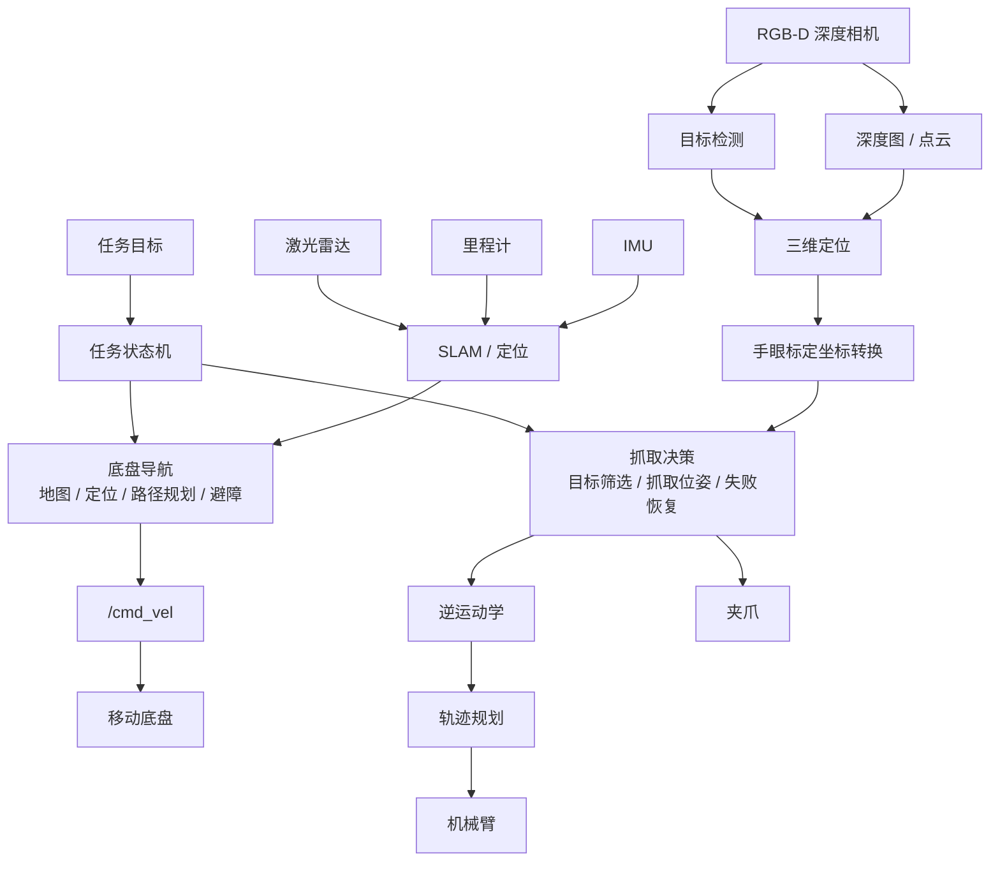

# 移动抓取机器人从 0 到 1：雷达导航、深度相机识别、机械臂自主抓取一次讲清

项目配套仓库：

[https://github.com/lelala271/mobile-manipulation-nav-grasp](https://github.com/lelala271/mobile-manipulation-nav-grasp)

这篇文章讲清一个完整移动抓取机器人系统怎么拆、怎么连、怎么部署、怎么联调。GitHub 仓库用于持续维护工程文档、源码目录、配置模板、启动文件、故障排查表和后续示例代码。

## 0. 这篇文章解决什么问题

很多移动抓取项目一开始会被简单描述成“给移动小车加一个机械臂”。这个说法能帮助理解外观，但不能指导工程实现。真正做系统时，问题会立刻变复杂：

```text
小车能导航，不代表能停在机械臂可抓的位置。
相机能识别目标，不代表能输出机械臂可用的三维坐标。
机械臂能运动，不代表能根据视觉目标自动抓取。
单个模块能跑，不代表整套系统能自主完成任务。
```

移动抓取机器人至少包含四条主线：

| 主线 | 解决的问题 | 典型模块 |
| --- | --- | --- |
| 底盘导航 | 机器人怎么从当前位置移动到抓取区域 | 地图、定位、Nav2、`cmd_vel` |
| 雷达避障 | 移动过程中如何感知障碍、规划路径和避障 | 激光雷达、SLAM、代价地图 |
| RGB-D 感知 | 目标在图像中哪里、在三维空间哪里 | RGB 图、Depth 图、相机内参、点云 |
| 机械臂抓取 | 末端怎么到目标点并完成夹取 | IK、轨迹规划、夹爪、MoveIt |
| 任务状态机 | 什么时候导航、什么时候识别、什么时候抓、失败后怎么办 | Behavior Tree、Action、自定义状态机 |

一句话结论：

```text
自主抓取不是一个单独算法，而是导航、三维感知、手眼标定、逆运动学、轨迹规划、夹爪控制和任务状态机共同构成的系统工程。
```

本文按工程落地顺序讲：

```text
先分清系统结构
再讲雷达导航链路
再讲深度相机三维定位
再讲机械臂逆解抓取
再讲 ROS 2 部署和联调
最后给排错表和 GitHub 仓库组织方式
```

## 1. 系统总览：移动抓取到底由哪些部分组成

移动抓取机器人可以按“感知、定位、规划、执行、任务编排”理解。



图 1：移动抓取系统总结构。雷达解决底盘导航问题，深度相机解决目标三维定位问题，机械臂解决局部操作问题，任务状态机把所有动作串成闭环。

完整任务链路可以写成下面这条流程：

```text
雷达建图或加载地图
-> 底盘定位
-> 导航到抓取区域
-> 深度相机采集 RGB 和 Depth
-> 目标检测输出二维框
-> 深度图提供目标距离
-> 相机内参完成像素反投影
-> 手眼标定把目标转到机械臂基座坐标系
-> 抓取策略生成预抓取位姿和抓取位姿
-> IK 求解关节角
-> 轨迹规划生成可执行路径
-> 夹爪闭合
-> 抬升验证
-> 导航到放置区
-> 放置并回安全位
```

这条链里任何一段缺失，系统都只能算局部功能可用，不能叫完整自主抓取。

## 2. 先把容易混淆的概念分清

机器人系统最怕“名词混用”。下面这张表先把核心概念分开：

| 名词 | 它是什么 | 它不是什么 | 在系统中的位置 |
| --- | --- | --- | --- |
| ROS 2 | 机器人中间件，负责节点通信、参数、TF、Action 等 | 不是导航算法，也不是机械臂算法 | 系统通信骨架 |
| TF | 坐标变换系统 | 不是普通日志，也不是可选配置 | 所有几何计算的基础 |
| Cartographer | SLAM 建图和位姿估计算法 | 不是完整自主导航框架 | 雷达建图模块 |
| Nav2 | ROS 2 导航框架 | 不是目标检测算法 | 底盘导航与避障 |
| AMCL | 静态地图定位算法 | 不是在线建图算法 | 已有地图中的定位 |
| RGB-D 相机 | 同时输出彩色图和深度图的相机 | 不直接控制底盘或机械臂 | 目标三维定位 |
| 手眼标定 | 求相机坐标系与机械臂坐标系的关系 | 不提升检测模型精度 | 坐标统一 |
| IK | Inverse Kinematics，逆运动学 | 不等于完整轨迹规划 | 末端位姿到关节角 |
| MoveIt | 机械臂运动规划框架 | 不负责底盘导航 | IK、规划、碰撞检测 |
| 任务状态机 | 编排导航、识别、抓取、放置和失败恢复 | 不是单个算法模型 | 系统总控 |

如果只能记一句：

```text
雷达让车知道怎么走，深度相机让系统知道目标三维位置，机械臂负责局部操作，状态机负责把它们按顺序组织起来。
```

## 3. 雷达导航链路：它解决“车怎么过去”

雷达在移动抓取系统中的主要作用是服务移动底盘，而不是识别要抓的物体。

雷达导航链路通常包含：

```text
激光雷达驱动
-> 里程计 / IMU
-> TF
-> SLAM 建图
-> 地图保存
-> 静态地图定位
-> 全局路径规划
-> 局部避障
-> 底盘速度控制
```

### 3.1 SLAM 解决什么

SLAM 是 Simultaneous Localization And Mapping，同步定位与建图。机器人在未知环境移动时，一边估计自己在哪里，一边建立环境地图。

常见 2D SLAM 输入：

```text
/scan：激光扫描
/odom：轮速里程计
/imu：IMU，可选
/tf：传感器和底盘坐标关系
```

常见输出：

```text
/map：地图
map -> odom：全局修正
机器人轨迹
```

Cartographer 的核心思想是：

```text
局部 SLAM 负责实时扫描匹配和子图构建
全局 SLAM 负责回环检测和位姿图优化
```

它擅长建图和位姿估计，但它不负责完整导航行为。导航到目标点、局部避障、速度控制，通常交给 Nav2。

### 3.2 Nav2 解决什么

Nav2 是 ROS 2 生态里的导航框架。它负责：

```text
加载地图
在地图中定位
生成全局路径
根据局部障碍实时避障
输出 /cmd_vel 控制底盘
用行为树组织导航流程
```

Nav2 常见组件：

| 组件 | 作用 |
| --- | --- |
| `map_server` | 加载并发布静态地图 |
| `amcl` | 在静态地图中定位 |
| `planner_server` | 生成全局路径 |
| `controller_server` | 跟踪路径并输出速度 |
| `behavior_server` | 执行恢复行为 |
| `bt_navigator` | 使用行为树组织导航 |
| `lifecycle_manager` | 管理节点生命周期 |

在移动抓取中，Nav2 的职责边界要明确：

```text
Nav2 只负责把底盘送到抓取区域附近
是否开始抓取，要由任务状态机结合视觉和机械臂状态判断
```

### 3.3 导航阶段验收标准

雷达导航链路至少要满足：

```text
地图没有明显重影
机器人定位和真实位置一致
全局路径合理
局部代价地图能看到障碍
底盘能稳定到达抓取区域
到点后姿态误差在可接受范围内
```

底盘到点精度非常重要。机械臂工作空间有限，如果底盘停得太远，目标即使识别正确，也可能不可达。

## 4. 深度相机链路：它解决“目标三维位置在哪里”

深度相机不是底盘底层控制模块。它在自主抓取中的核心价值，是把二维视觉结果转换成机械臂能使用的三维目标点。

### 4.1 RGB 检测只能得到二维信息

目标检测模型通常输出：

```text
类别 class
置信度 confidence
二维框 bbox
```

例如：

```text
class = bottle
confidence = 0.91
bbox = [u_min, v_min, u_max, v_max]
```

这只能说明目标在图像中的位置，不能直接用于机械臂抓取。机械臂需要的是：

```text
目标在 arm_base_link 坐标系下的 x, y, z
抓取方向
预抓取点
抓取点
夹爪开口
抬升方向
```

### 4.2 深度图提供距离

深度图每个像素存储该像素对应空间点的距离。检测到目标框后，不能简单取框中心点深度，因为框中心可能是空洞、反光点、边缘或背景。

更稳的处理方式：

```text
取目标框中心区域 ROI
过滤深度为 0 或 NaN 的像素
过滤过近和过远的异常值
取中位数或截尾均值
得到目标代表深度
```

中位数常比均值更稳，因为它不容易被少量异常深度拉偏。

### 4.3 像素反投影把二维点变成三维点

相机内参通常包含：

```text
fx, fy：焦距
cx, cy：主点
```

像素点 `(u, v)` 和深度 `Z` 可以反投影到相机坐标系：

```text
X = (u - cx) * Z / fx
Y = (v - cy) * Z / fy
Z = depth
```

这一步之后得到的是相机坐标系下的三维点，不是机械臂坐标系下的点。

### 4.4 手眼标定把相机坐标转成机械臂坐标

机械臂通常以 `arm_base_link` 为基准执行运动。相机输出的是 `camera_color_optical_frame` 或类似坐标系下的目标点。两者必须通过手眼标定建立变换关系：

```text
P_arm_base = T_arm_base_camera * P_camera
```

常见两种安装方式：

| 类型 | 相机安装位置 | 优点 | 难点 |
| --- | --- | --- | --- |
| eye-to-hand | 相机固定在底盘、支架或外部位置 | 视野稳定，适合先识别再抓取 | 相机和机械臂外参必须准确 |
| eye-in-hand | 相机固定在机械臂末端 | 可近距离二次定位 | 标定和运动补偿更复杂 |

如果手眼标定错了，表现通常是：

```text
目标点左右反
目标高度不对
机械臂总是抓偏固定距离
目标明明可见，但转换后不可达
```

## 5. 机械臂链路：它解决“怎么抓”

机械臂抓取不是“给一个点就过去”。完整抓取至少包括：

```text
目标可达性判断
抓取姿态生成
逆运动学求解
轨迹规划
碰撞检测
夹爪闭合
抓取结果验证
失败恢复
```

### 5.1 正运动学和逆运动学

正运动学 FK：

```text
输入：关节角
输出：末端位姿
```

逆运动学 IK：

```text
输入：末端目标位姿
输出：关节角
```

抓取时，视觉系统先给出目标位姿，所以机械臂需要 IK。IK 可能失败，常见原因：

```text
目标超出机械臂工作空间
末端姿态约束太严格
关节限位冲突
机械臂接近奇异位形
碰撞检测不允许该姿态
```

### 5.2 IK 有解不等于能执行

IK 只说明某个末端位姿可能对应一组关节角，不代表机械臂能安全从当前位置运动过去。真正执行前还要做轨迹规划和碰撞检测。

轨迹规划需要考虑：

```text
机械臂自身碰撞
机械臂与底盘碰撞
机械臂与环境碰撞
关节速度限制
关节加速度限制
末端路径是否穿过障碍
```

### 5.3 抓取动作要拆阶段

建议抓取流程拆成：

| 阶段 | 作用 |
| --- | --- |
| Home | 回到安全初始姿态 |
| Pre-grasp | 到达目标前方或上方的预抓取位 |
| Approach | 低速接近目标 |
| Close | 夹爪闭合 |
| Lift | 抬升并判断是否抓稳 |
| Retreat | 撤离到安全运输姿态 |
| Place | 到放置区打开夹爪 |

阶段化设计的好处是：失败时知道失败发生在哪一步。识别失败、IK 失败、夹爪失败、放置失败，对应的恢复动作完全不同。

## 6. ROS 2 工程结构建议

一个可维护的工程不应该把所有逻辑写在一个脚本里。建议按模块拆包：

```text
mobile_manipulation_ws/
├── src/
│   ├── navigation_bringup/
│   ├── perception_3d/
│   ├── arm_bringup/
│   ├── grasp_planner/
│   └── task_manager/
├── maps/
├── calibration/
├── model_weights/
├── config/
└── launch/
```

模块职责：

| 包 | 职责 |
| --- | --- |
| `navigation_bringup` | 底盘、雷达、SLAM、Nav2 启动 |
| `perception_3d` | 目标检测、深度处理、三维定位 |
| `arm_bringup` | 机械臂驱动、夹爪驱动、MoveIt 启动 |
| `grasp_planner` | 抓取点和抓取姿态生成 |
| `task_manager` | 导航、识别、抓取、放置状态机 |

### 6.1 话题、服务、Action 怎么选

| 通信方式 | 适合内容 | 示例 |
| --- | --- | --- |
| Topic | 高频连续数据 | 图像、雷达、里程计、关节状态 |
| Service | 短请求短响应 | 保存地图、切换模式、查询状态 |
| Action | 耗时任务，有反馈，可取消 | 导航到点、执行抓取、机械臂轨迹 |

自主抓取建议设计成 Action，因为它包含多个耗时阶段，需要反馈和取消。

## 7. 推荐部署路线

推荐主线：

```text
Ubuntu 22.04 + ROS 2 Humble
```

ROS 2 Humble 安装参考官方文档：

[ROS 2 Humble Ubuntu 安装文档](https://docs.ros.org/en/humble/Installation/Ubuntu-Install-Debs.html)

常用工作空间编译流程：

```bash
mkdir -p ~/mobile_manipulation_ws/src
cd ~/mobile_manipulation_ws
rosdep install --from-paths src --ignore-src -r -y
colcon build --symlink-install
source install/setup.bash
```

常用检查命令：

```bash
ros2 node list
ros2 topic list
ros2 topic hz /scan
ros2 topic echo /odom
ros2 run tf2_tools view_frames
```

## 8. 联调顺序

不要一开始就全系统一起跑。推荐按下面顺序验收：

1. 底盘能响应 `/cmd_vel`。
2. 雷达能稳定发布 `/scan`。
3. 里程计和 TF 正常。
4. 建图成功，并能保存地图。
5. Nav2 能在静态地图中导航到指定点。
6. 深度相机 RGB、Depth、CameraInfo 正常。
7. 目标检测能稳定输出二维框。
8. 深度反投影输出目标三维点。
9. 手眼标定能把目标点转到机械臂基座坐标。
10. 机械臂能对固定点执行抓取。
11. IK 和轨迹规划可用。
12. 任务状态机串联导航、识别、抓取和放置。

这个顺序的核心思想是：

```text
先局部闭环
再模块联调
最后做全系统闭环
```

## 9. 常见问题排查表

| 现象 | 常见原因 | 检查方法 | 解决方向 |
| --- | --- | --- | --- |
| 地图重影 | TF 错、时间不同步、里程计跳变 | 看 TF 树、看 `/odom` 是否连续 | 修 TF、同步时间、降低建图速度 |
| 导航能规划但不走 | `/cmd_vel` 没到驱动、Nav2 未激活 | `ros2 topic echo /cmd_vel` | 检查 remap 和 lifecycle |
| 机器人贴墙 | footprint 太小、膨胀半径太小 | 看 costmap | 调整 footprint 和 inflation |
| RGB 正常但深度无效 | 相机参数或对齐模式错误 | 看 Depth 图和 CameraInfo | 修相机启动参数 |
| 识别到目标但抓不到 | 只有二维框，没有三维坐标或手眼标定 | 打印目标点和 TF | 加深度反投影和坐标转换 |
| 目标点左右反 | optical frame 用错 | 检查相机坐标系 | 区分 `camera_link` 和光学坐标系 |
| IK 无解 | 目标不可达、姿态约束过严 | RViz 显示目标点 | 调整底盘站位或抓取姿态 |
| 轨迹规划失败 | 碰撞模型错误、关节状态不同步 | 看 PlanningScene | 修 URDF/SRDF 和 joint state |
| 抓取后掉落 | 抓取点不对、夹爪力不足 | 看抓取视频和夹爪状态 | 调整抓取策略和夹爪参数 |
| 单模块正常，全系统失败 | 状态机缺等待、超时和恢复 | 看任务日志时间线 | 明确每个状态的成功和失败条件 |

## 10. GitHub 仓库应该放什么

CSDN 适合讲清路线，GitHub 适合维护工程。推荐仓库包含：

```text
mobile-manipulation-nav-grasp/
├── README.md
├── docs/
│   ├── csdn/
│   ├── architecture/
│   ├── deployment/
│   └── troubleshooting/
├── src/
│   ├── navigation/
│   ├── perception/
│   ├── manipulation/
│   └── task_manager/
├── config/
├── launch/
├── scripts/
└── assets/
```

这个结构的好处：

```text
CSDN 负责讲清整体思路
GitHub 负责维护源码、配置、脚本、图片和后续更新
读者先读文章建立理解，再进仓库看工程细节
```

项目配套仓库：

[https://github.com/lelala271/mobile-manipulation-nav-grasp](https://github.com/lelala271/mobile-manipulation-nav-grasp)

## 11. 最终记忆表

| 问题 | 结论 |
| --- | --- |
| 雷达做什么 | 建图、定位、导航、避障 |
| 深度相机做什么 | 把目标从二维图像变成三维坐标 |
| 机械臂做什么 | IK、轨迹规划、夹爪抓取 |
| 手眼标定做什么 | 统一相机坐标系和机械臂坐标系 |
| Nav2 做什么 | 路径规划、局部避障、速度输出 |
| Cartographer 做什么 | SLAM 建图和位姿估计 |
| MoveIt 做什么 | 机械臂运动规划和碰撞检测 |
| 状态机做什么 | 串联完整任务并处理失败 |

最后用一句话收束：

```text
移动抓取系统的关键不是堆算法名，而是让导航、感知、坐标、机械臂规划和任务状态机形成可靠闭环。
```

## 12. 参考资料

- [ROS 2 Humble Ubuntu 安装文档](https://docs.ros.org/en/humble/Installation/Ubuntu-Install-Debs.html)
- [ROS 2 Tutorials](https://docs.ros.org/en/humble/Tutorials.html)
- [Navigation2 官方文档](https://docs.nav2.org/)
- [Cartographer ROS 文档](https://google-cartographer-ros.readthedocs.io/)
- [Cartographer ROS 算法讲解](https://google-cartographer-ros.readthedocs.io/en/latest/algo_walkthrough.html)
- [Cartographer ROS 配置文档](https://google-cartographer-ros.readthedocs.io/en/latest/configuration.html)
- [MoveIt 2 官方文档](https://moveit.picknik.ai/main/index.html)
